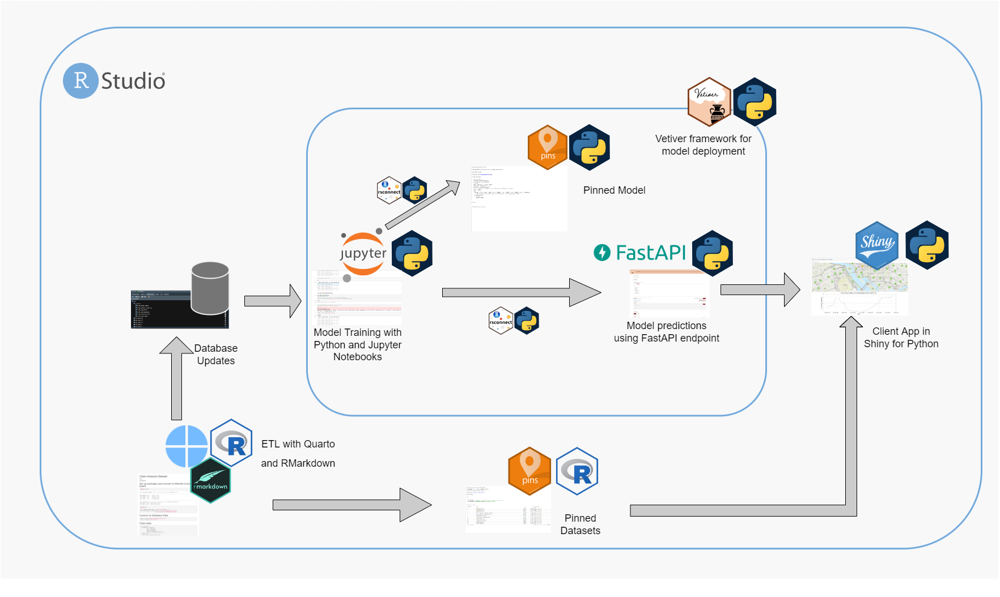

# Bike Predict Machine Learning Pipeline using Python

This repository is an equivalent of the Bike Predict example built in R, but it uses Python to achieve a similar workflow. It is built using Python packages vetiver, pins and Shiny for Python and is deploybale on [RStudio Connect](https://rstudio.com/products/connect/), 

## Who This is For

This repository is aimed for bilingual data scientists who want to utilize both and R python in their data science workflow. It can also be used as example by bilingual data science teams to find ways to colloborate language agnostic tools like vetiver and Shiny.  

### WIP

add more details on the workflow.

## What doesn't it do

TBD

## Individual Content

## Contributing

See a problem or want to contribute? Please refer to the [contributing page](./CONTRBUTING.md).
