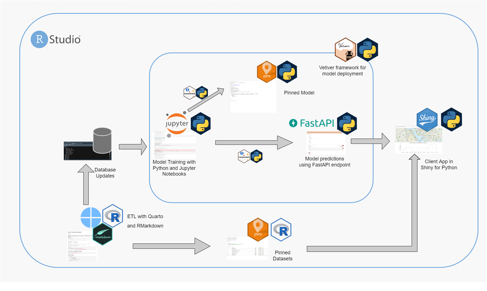

# Bike Predict - Machine Learning in Python with RStudio Connect

This repository contains an example of using [pins](https://rstudio.github.io/pins-python/), [vetiver](https://vetiver.tidymodels.org), [Shiny for Python](https://shiny.rstudio.com/py/) to create a machine learning project in Python. Everything is deployable on [RStudio Connect](https://rstudio.com/products/connect/). 

## Who This is For

1. Python data scientists who want to build machine learning projects with existing interoperable data assets from R processes scheduled to run on [RStudio Connect](https://rstudio.com/products/connect/).
2. Multilingual data scientists who want to utilize both R and Python in their data science workflow. It can also be used as an example for multilingual data science teams to colloborate with open source tools like pins, vetiver, and Shiny.

## Individual Content

### Model - Train and Deploy Model

- **Description:** From *Content DB* get the *bike_model_data* table and then train a model. The model is saved to Connect as a pin, and then deployed to Connect as a plumber API using vetiver.
- **Code:** [model/01-train-and-deploy-model/model_training_deployment.ipynb](model/01-train-and-deploy-model/model_training_deployment.ipynb)
- **Deployed Content:**
    - Jupyter Notebook (<https://colorado.rstudio.com/rsc/bikeshare-model-retraining/> | [Dashboard View](https://colorado.posit.co/rsc/connect/#/apps/725e31c7-1588-45bb-95d6-cee508798145))
    - Model Pin (<https://colorado.rstudio.com/rsc/bikeshare-rf-python/> | [Dashboard View](https://colorado.posit.co/rsc/connect/#/apps/6a925a0f-349d-4d57-ad67-8b151c07808d))
    - Vetiver API: (<https://colorado.rstudio.com/rsc/bike-predict-python-api/> | [Dashboard View](https://colorado.posit.co/rsc/connect/#/apps/28923e33-dcb6-4774-b753-bf1d4c367579))

### App - Client App

- **Description:** Use the API endpoint to interactively serve predictions to a shiny app.
- **Code:** [app/app.py](app/app.py)
- **Deployed Content:** 
    - Shiny App (<https://colorado.posit.co/rsc/bike-share-python-app/> | [Dashboard View](https://colorado.posit.co/rsc/connect/#/apps/0e6cc3a1-b168-40fe-9093-ce9fa403a1ea))

### App - Dev Client App

- **Description:** A development version of the client app.   
- **Code:** [app-dev/app.py](app-dev/app.py)
- **Deployed Content:** 
    - Shiny App (<https://colorado.rstudio.com/rsc/bike-share-python-dev/> | [Dashboard View](https://colorado.posit.co/rsc/connect/#/apps/48254833-a1b9-44a0-b441-ec762d825cdf))

## Contributing

See a problem or want to contribute? Please refer to the [contributing page](./CONTRBUTING.md).
