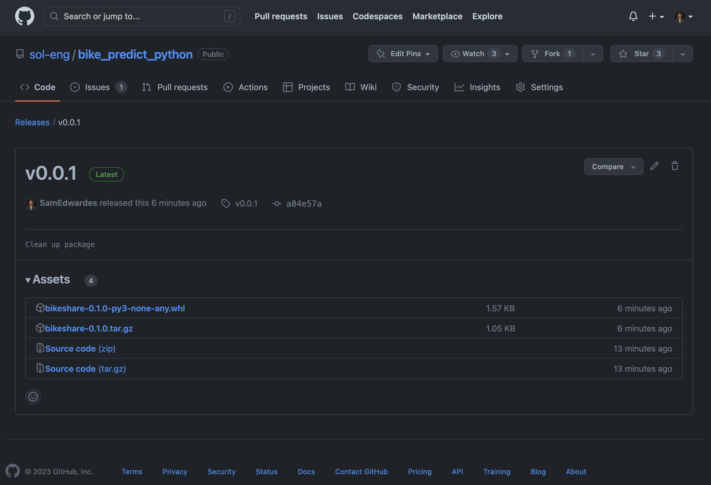

# bikeshare

A package for working with Washington DC bike share data.

## Publishing

1. Install poetry (https://python-poetry.org/docs/#installation).

```bash
curl -sSL https://install.python-poetry.org | python3 -
```

2. Bump the version.

```bash
poetry version minor
```

3. Build a new wheel.

```bash
poetry build
```

4. Create a new release on GitHub, upload the new wheels that were created. Make sure that the release matches the version in `pyproject.toml`.

